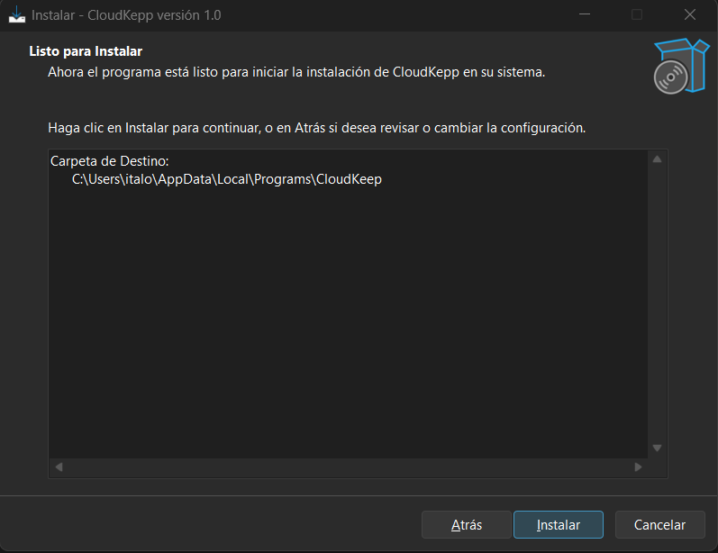
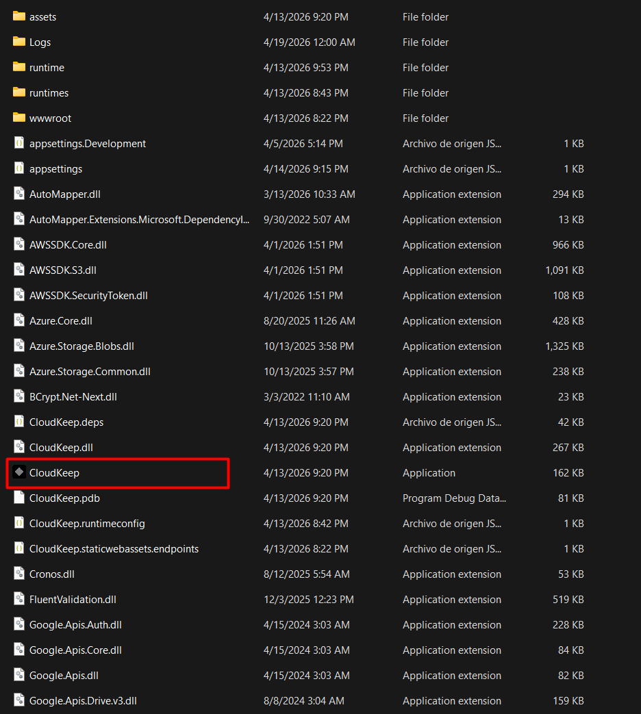
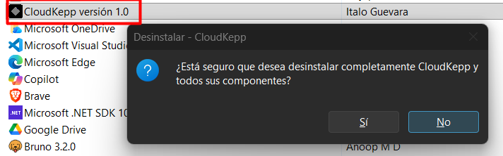

# Guia de instalacion - CloudKeep

## 1. Requisitos previos

- Sistema operativo Windows x64 o Windows 11 ARM.
- Archivo instalador : `setup.exe`.

---

## 2. Instalacion de CloudKeep (usuario final)

1. Ejecuta `setup.exe`.
2. Selecciona el modo de instalación(Todos los usuarios, Solo este usuario).
3. Selecciona la carpeta de destino (por defecto `C:\Program Files\CloudKeep`).
4. Indica sí desea crear un acceso directo en el escritorio.
5. Confirma la instalación y espera a que finalice.
6. Opcional: dejar marcada la casilla para abrir CloudKeep al terminar.

---

## 3. Que instala automaticamente

- `CloudKeep.exe` y archivos de la aplicacion en la carpeta destino.
- Acceso directo en el menu Inicio.

---
   
   
      
## 4. Desinstalacion

- Desde **Configuracion > Aplicaciones** en Windows, buscar **CloudKeep** y desinstalar.

---

## 5. Checklist rapido

- [ ] Instalacion exitosa en equipo de prueba.
- [ ] CloudKeep abre sin errores.
- [ ] Accesos directos creados segun configuracion.
- [ ] Desinstalacion completada sin residuos criticos.

